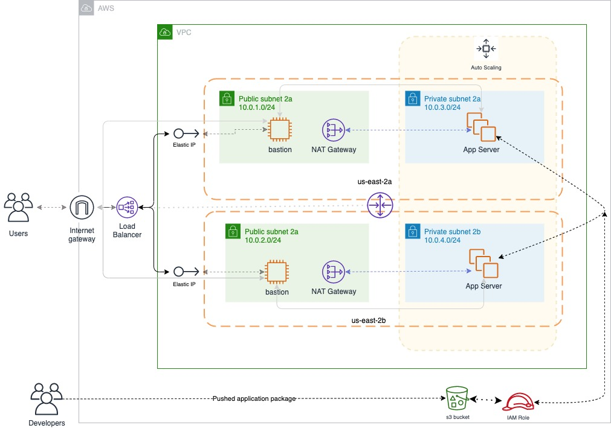

# The Landscaping Project

This project uses AWS related services to deploy a high-availability web application using CloudFormation.

## How to deploy the application

Here we assume the AWS toolkit and SDK are installed on your computer. To deploye the application following instructions:

### 1. Create the infrastructure

```
./create.sh infrastructure network.yml network-parameters.json
```

### 2. Deploy the bastion host

```
./create bostion bastion.yml bastion-param.json
```

### 3. Deploy the server

```
./create servers servers.yml servers-parameters.json
```

The project infrastructure diagram is as followed:


